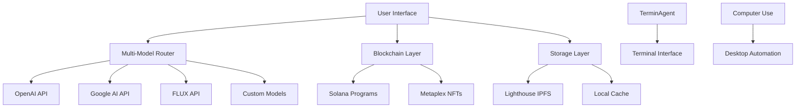

# 🚀 X402 Agent Hub: The Ultimate Vibe Coding Studio

<div align="center">


**🌟 A revolutionary multi-model AI platform that transforms creativity into programmable NFTs on Solana**

*Where AI meets blockchain innovation*

</div>

---

## 🎯 What is X402 Agent Hub?

X402 Agent Hub is the world's first **"vibe coding studio"** - a next-generation platform that seamlessly blends AI creativity with blockchain technology. Create apps, art, and code with multiple AI models, then deploy them as programmable NFTs or Solana programs with a single click.

### 🌈 The Vibe
- **✨ Multi-Model Magic**: Switch between OpenAI, Google, FLUX, and custom models effortlessly
- **🤖 AI-First Experience**: Every interaction is powered by cutting-edge AI
- **🎨 Creative Freedom**: From terminal automation to artistic masterpieces
- **⚡ Instant Deployment**: One-click NFT minting and Solana program deployment
- **🌍 Decentralized**: Built on IPFS and Solana for true ownership

---

## 🚀 Features Overview

<div align="center">

| 🌟 **Multi-Model Studio** | 🤖 **TerminAgent** | 🖥️ **Computer Use** | 🎨 **AI Art Studio** | ⚡ **FLUX Generator** |
|:------------------------:|:------------------:|:-------------------:|:--------------------:|:--------------------:|
| Unified AI Experience | Terminal Assistant | Desktop Automation | Multi-Model Art | Lightning Fast Images |
| Switch providers seamlessly | Smart CLI commands | Full screen control | Professional quality | Real-time generation |
| Code, chat, create | Error debugging | Mouse & keyboard | Multiple styles | Ultra high resolution |

</div>

### 🎯 Core Studios

#### 🌟 **Multi-Model AI Studio**
The heart of X402 - a unified interface for all AI interactions.

**Features:**
- **🔄 Provider Switching**: OpenAI, Google Gemini, FLUX, DeepSolana
- **🛠️ Tool Integration**: Web search, code execution, file operations
- **💬 Smart Chat**: Context-aware conversations
- **📊 Analytics**: Track usage across models

**Use Cases:**
- Code generation and debugging
- Research and analysis
- Creative writing
- Problem solving

#### 🤖 **TerminAgent**
Your AI-powered terminal companion that understands context and executes complex workflows.

**Features:**
- **🎯 Smart Commands**: Natural language to CLI translation
- **🔍 Error Analysis**: Automatic debugging and solutions
- **📝 Command History**: Learn from past interactions
- **🔗 Context Awareness**: Understands your project structure

**Example:**
```bash
User: "Install dependencies and start the dev server"
TerminAgent: "npm install && npm run dev"
```

#### 🖥️ **Computer Use Agent**
Revolutionary desktop automation powered by Claude's computer use capabilities.

**Features:**
- **👀 Screen Analysis**: AI sees and understands your screen
- **🖱️ Precise Control**: Automated mouse and keyboard actions
- **📱 App Integration**: Works with any desktop application
- **🔄 Workflow Automation**: Record and replay complex tasks

**Use Cases:**
- Automated testing
- Data entry
- File organization
- Software tutorials

#### 🎨 **AI Art Studio**
Professional-grade image generation with multiple AI models.

**Features:**
- **🎭 Style Presets**: 16+ artistic styles (Photorealistic, Anime, Cyberpunk, etc.)
- **📏 Aspect Ratios**: Square, Portrait, Landscape, Cinematic, etc.
- **⚙️ Fine Control**: Quality, creativity, negative prompts
- **💾 Gallery Management**: Like, download, copy prompts
- **🔄 Cross-Model**: Regenerate with different providers

**Supported Models:**
- OpenAI DALL-E 3
- Google Imagen
- FLUX.1 Pro/Schnell
- Midjourney v6.1

#### ⚡ **FLUX Generator**
Ultra-fast image generation optimized for speed and quality.

**Features:**
- **🚀 Lightning Speed**: Generate images in seconds
- **🎯 Specialized Models**: FLUX.1 Schnell for rapid prototyping
- **🔧 Optimized Workflow**: Streamlined interface for quick creation
- **📱 Mobile Ready**: Works perfectly on all devices

---

## 🌐 Blockchain Integration

### 💎 **Programmable NFTs**
Transform your creations into programmable NFTs with royalty enforcement.

**Features:**
- **⚖️ Royalty Enforcement**: Metaplex Core standard with rule sets
- **👥 Multi-Creator Support**: Split royalties between collaborators
- **🔒 Transfer Rules**: Custom restrictions and allowlists
- **📊 Creator Dashboard**: Track sales and royalties

**Process:**
1. Create content in any studio
2. Click "Deploy as NFT"
3. Configure royalties and rules
4. Mint to Solana (devnet/mainnet)

### 💻 **Solana Program Deployment**
Deploy smart contracts with multiple frameworks.

**Supported Frameworks:**
- **⚓ Anchor**: High-level framework with automatic serialization
- **🦀 Native Rust**: Low-level programs with full control
- **🐍 Seahorse**: Python-like syntax for easier development

**Features:**
- **📁 Auto-Generated Structure**: Proper Cargo.toml and lib.rs
- **💰 Cost Estimation**: Deployment cost calculator
- **📦 IPFS Storage**: Source code and bytecode preservation
- **🔍 Explorer Integration**: Direct links to Solana Explorer

### 🌍 **IPFS Storage via Lighthouse**
Decentralized storage for all your creations.

**Features:**
- **⚡ Fast Uploads**: Optimized for large files
- **💰 Cost Effective**: Cheaper than Arweave
- **🔄 Redundancy**: Multiple storage nodes
- **🔒 Permanent Storage**: Your content lives forever

---

## 🛠️ Installation & Setup

### Prerequisites
```bash
Node.js 18+ 
TypeScript 5+
Solana CLI (optional)
```

### Quick Start
```bash
# Clone the repository
git clone https://github.com/8bitsats/fragments.git
cd fragments

# Install dependencies
npm install

# Set up environment variables
cp .env.example .env
# Edit .env with your API keys

# Start development server
npm run dev
```

### Environment Configuration
```bash
# Core AI Providers
OPENAI_API_KEY=sk-...
ANTHROPIC_API_KEY=sk-ant-...
GOOGLE_AI_API_KEY=...

# Solana Configuration
SOLANA_DEVNET_RPC=https://api.devnet.solana.com
SOLANA_PAYER_PRIVATE_KEY=[1,2,3,...]

# IPFS Storage
LIGHTHOUSE_API_KEY=...

# Optional: Rate Limiting
RATE_LIMIT_MAX_REQUESTS=100
RATE_LIMIT_WINDOW=3600
```

---

## 🎮 How to Use

### 1. **Getting Started**
1. Open the platform at `localhost:3000`
2. Connect your Solana wallet (optional)
3. Choose your preferred AI studio
4. Start creating!

### 2. **Creating with AI**
```typescript
// Example: Multi-Model Chat
const response = await fetch('/api/openai-unified', {
  method: 'POST',
  body: JSON.stringify({
    provider: 'openai', // or 'google', 'flux', 'deepsolana'
    model: 'gpt-4.1',
    messages: [{ role: 'user', content: 'Create a React component' }],
    tools: ['code_interpreter', 'web_search']
  })
});
```

### 3. **Deploying as NFT**
```typescript
// Example: Mint Programmable NFT
const nft = await fetch('/api/mint-solana-nft', {
  method: 'POST',
  body: JSON.stringify({
    name: "My AI Creation",
    description: "Generated with X402 Agent Hub",
    image: "ipfs://...",
    creators: [{ address: walletKey, share: 100 }],
    sellerFeeBasisPoints: 500, // 5% royalty
    ruleSet: null // Use default Metaplex rules
  })
});
```

### 4. **Deploying Solana Program**
```typescript
// Example: Deploy Anchor Program
const program = await fetch('/api/deploy-solana-program', {
  method: 'POST',
  body: JSON.stringify({
    framework: 'anchor',
    programName: 'my-program',
    sourceCode: rustCode,
    network: 'devnet'
  })
});
```

---

## 🎨 Studio Guides

### 🌟 **Multi-Model Studio Guide**

1. **Select Provider**: Choose between OpenAI, Google, FLUX, or DeepSolana
2. **Configure Tools**: Enable web search, code execution, or file operations
3. **Chat Interface**: Natural conversation with context retention
4. **Export Options**: Save conversations, copy code, deploy creations

### 🤖 **TerminAgent Guide**

1. **Natural Commands**: Type what you want to accomplish
2. **Context Awareness**: It understands your project structure
3. **Error Handling**: Automatic debugging and suggestions
4. **Workflow Recording**: Save complex command sequences

### 🎨 **AI Art Studio Guide**

1. **Choose Provider**: OpenAI DALL-E, Google Imagen, FLUX, or Midjourney
2. **Set Parameters**: Style, aspect ratio, quality, creativity
3. **Write Prompt**: Describe your artistic vision
4. **Generate & Refine**: Create multiple variations
5. **Gallery Management**: Organize and export your creations

---

## 🏗️ Architecture



### Tech Stack
- **Frontend**: Next.js 14, React 18, TypeScript
- **UI**: Tailwind CSS, shadcn/ui, Lucide Icons
- **AI**: OpenAI, Anthropic, Google AI, FLUX
- **Blockchain**: Solana Web3.js, Metaplex JS SDK
- **Storage**: Lighthouse (IPFS), Local caching
- **Auth**: Privy (Wallet connection)

---

## 🔧 API Reference

### Multi-Model Unified API
```typescript
POST /api/openai-unified
{
  "provider": "openai" | "google" | "flux" | "deepsolana",
  "model": string,
  "messages": ChatMessage[],
  "tools": Tool[],
  "temperature": number,
  "max_tokens": number
}
```

### NFT Minting API
```typescript
POST /api/mint-solana-nft
{
  "name": string,
  "description": string,
  "image": string,
  "creators": Creator[],
  "sellerFeeBasisPoints": number,
  "ruleSet": string | null
}
```

### Program Deployment API
```typescript
POST /api/deploy-solana-program
{
  "framework": "anchor" | "native" | "seahorse",
  "programName": string,
  "sourceCode": string,
  "network": "devnet" | "mainnet"
}
```

### Lighthouse Storage API
```typescript
POST /api/upload-to-lighthouse
{
  "content": string | Buffer,
  "filename": string,
  "metadata": object
}
```

---

## 🌟 Examples & Tutorials

### Example 1: Create and Deploy an NFT Collection
```typescript
// 1. Generate art in AI Art Studio
const artwork = await generateArt({
  prompt: "Cyberpunk city skyline",
  style: "Digital Art",
  provider: "flux"
});

// 2. Deploy as programmable NFT
const nft = await mintNFT({
  name: "Cyberpunk City #1",
  image: artwork.url,
  royalties: 5
});

// 3. Share on social media
shareTo("twitter", `Just created my first AI NFT! ${nft.explorerUrl}`);
```

### Example 2: Automate Development Workflow
```typescript
// Use TerminAgent to set up a new project
await terminAgent.execute([
  "Create a new Next.js project called 'my-dapp'",
  "Install Solana dependencies",
  "Set up a basic wallet connection",
  "Start the development server"
]);
```

### Example 3: Deploy a Solana Program
```rust
// Create program in Multi-Model Studio
use anchor_lang::prelude::*;

#[program]
pub mod my_program {
    use super::*;
    
    pub fn initialize(ctx: Context<Initialize>) -> Result<()> {
        // Your program logic here
        Ok(())
    }
}

// Deploy with one click
await deployProgram({
  framework: "anchor",
  code: rustCode,
  network: "devnet"
});
```

---

## 🤝 Contributing

We welcome contributions! Here's how to get started:

1. **Fork the Repository**
2. **Create a Feature Branch**: `git checkout -b feature/amazing-feature`
3. **Commit Changes**: `git commit -m 'Add amazing feature'`
4. **Push to Branch**: `git push origin feature/amazing-feature`
5. **Open Pull Request**

### Development Guidelines
- Write TypeScript with strict mode
- Follow the existing code style
- Add tests for new features
- Update documentation

---

## 📝 License

This project is licensed under the MIT License - see the [LICENSE](LICENSE) file for details.

---

## 🙏 Acknowledgments

- **Metaplex Foundation** for programmable NFT standards
- **Solana Labs** for the incredible blockchain platform
- **OpenAI, Anthropic, Google** for AI model APIs
- **Lighthouse** for decentralized storage
- **The open-source community** for amazing tools and libraries

---

## 📞 Support & Community

- **Documentation**: [docs.x402.ai](https://docs.x402.ai)
- **Discord**: [Join our community](https://discord.gg/x402)
- **Twitter**: [@x402_ai](https://twitter.com/x402_ai)
- **GitHub Issues**: [Report bugs](https://github.com/8bitsats/fragments/issues)

---

<div align="center">

**🚀 Built with ❤️ by the X402 Team**

*Making AI accessible, creative, and profitable for everyone*

[](https://github.com/8bitsats/fragments)
[](https://twitter.com/x402_ai)

</div>
