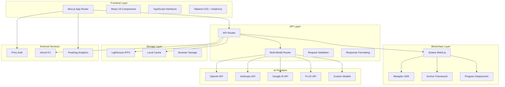

# 🏗️ X402 Agent Hub Architecture

*Deep dive into the technical architecture powering the ultimate vibe coding studio*

---

## 🌟 System Overview

X402 Agent Hub is built as a modern, scalable web application with a focus on AI integration, blockchain connectivity, and real-time user experience.



---

## 🎯 Core Architecture Principles

### 1. **Multi-Model First**
Every component is designed to work seamlessly with multiple AI providers.

```typescript
interface AIProvider {
  id: string;
  name: string;
  models: string[];
  capabilities: string[];
  endpoint: string;
  authenticate: (key: string) => boolean;
}

// Unified interface for all AI interactions
class ModelRouter {
  async generateResponse(
    provider: AIProvider,
    request: GenerationRequest
  ): Promise<GenerationResponse> {
    // Normalize request format
    const normalizedRequest = this.normalizeRequest(request, provider);
    
    // Route to appropriate provider
    return await this.routeToProvider(provider, normalizedRequest);
  }
}
```

### 2. **Component-Driven Design**
Modular, reusable components that can be composed into different studios.

```
components/
├── studios/              # Main studio interfaces
│   ├── MultiModelStudio.tsx
│   ├── AIArtStudio.tsx
│   └── TerminAgent.tsx
├── ui/                  # Reusable UI components
│   ├── button.tsx
│   ├── input.tsx
│   └── dialog.tsx
├── providers/           # Context providers
│   ├── AIProvider.tsx
│   ├── WalletProvider.tsx
│   └── ThemeProvider.tsx
└── deployment/          # Deployment components
    ├── NFTDeployButton.tsx
    └── ProgramDeployButton.tsx
```

### 3. **API-First Development**
All functionality exposed through clean, versioned APIs.

```typescript
// Example API structure
/api/v1/
├── ai/
│   ├── chat
│   ├── generate-image
│   └── execute-code
├── blockchain/
│   ├── mint-nft
│   ├── deploy-program
│   └── upload-metadata
└── storage/
    ├── upload-file
    └── get-file
```

---

## 🔧 Frontend Architecture

### **Next.js App Router Structure**

```
app/
├── layout.tsx           # Root layout with providers
├── page.tsx            # Main dashboard
├── globals.css         # Global styles
├── providers.tsx       # Client-side providers
├── api/               # API routes
│   ├── openai-unified/
│   ├── mint-solana-nft/
│   └── deploy-solana-program/
└── (dashboard)/       # Route groups
    ├── studio/
    ├── art/
    └── terminal/
```

### **State Management Strategy**

```typescript
// Context-based state management for global state
interface AppState {
  selectedProvider: AIProvider;
  walletConnection: WalletState;
  userPreferences: UserPreferences;
  activeStudio: StudioType;
}

// Local state for component-specific data
const [generatedContent, setGeneratedContent] = useState<Content[]>([]);
const [isGenerating, setIsGenerating] = useState(false);

// Optimistic updates for better UX
const generateContent = async () => {
  // Immediately update UI
  setIsGenerating(true);
  
  try {
    const result = await fetch('/api/generate');
    // Update with real data
    setGeneratedContent(prev => [result, ...prev]);
  } catch (error) {
    // Revert optimistic update
    setIsGenerating(false);
  }
};
```

### **Responsive Design System**

```css
/* Mobile-first responsive design */
.studio-grid {
  @apply grid grid-cols-1;
  
  @screen md {
    @apply grid-cols-2;
  }
  
  @screen lg {
    @apply grid-cols-3;
  }
  
  @screen xl {
    @apply grid-cols-4;
  }
}

/* Dark mode support */
.studio-card {
  @apply bg-white dark:bg-gray-800;
  @apply border border-gray-200 dark:border-gray-700;
  @apply text-gray-900 dark:text-gray-100;
}
```

---

## 🤖 AI Integration Layer

### **Unified AI Interface**

```typescript
interface UnifiedAIRequest {
  provider: 'openai' | 'google' | 'anthropic' | 'flux';
  model: string;
  messages?: ChatMessage[];
  tools?: Tool[];
  temperature?: number;
  max_tokens?: number;
  image_params?: ImageGenerationParams;
}

class AIManager {
  private providers: Map<string, AIProvider>;
  
  async processRequest(request: UnifiedAIRequest): Promise<AIResponse> {
    const provider = this.providers.get(request.provider);
    
    // Normalize request format for provider
    const normalized = await this.normalizeRequest(request, provider);
    
    // Handle rate limiting and retries
    return await this.withRateLimit(async () => {
      return await provider.generate(normalized);
    });
  }
  
  private async normalizeRequest(
    request: UnifiedAIRequest, 
    provider: AIProvider
  ): Promise<ProviderRequest> {
    // Convert unified format to provider-specific format
    switch (provider.type) {
      case 'openai':
        return this.toOpenAIFormat(request);
      case 'google':
        return this.toGoogleFormat(request);
      // ... other providers
    }
  }
}
```

### **Tool Integration System**

```typescript
interface Tool {
  type: 'web_search' | 'code_execution' | 'image_generation' | 'file_access';
  config: ToolConfig;
}

class ToolManager {
  async executeTool(tool: Tool, context: ExecutionContext): Promise<ToolResult> {
    switch (tool.type) {
      case 'web_search':
        return await this.executeWebSearch(tool.config, context);
      
      case 'code_execution':
        return await this.executeCode(tool.config, context);
      
      case 'image_generation':
        return await this.generateImage(tool.config, context);
      
      case 'file_access':
        return await this.accessFile(tool.config, context);
    }
  }
  
  private async executeCode(config: CodeConfig, context: ExecutionContext) {
    // Sandbox code execution with security measures
    const sandbox = new CodeSandbox({
      timeout: 30000,
      memoryLimit: '128MB',
      allowedModules: config.allowedModules
    });
    
    return await sandbox.execute(config.code, context.environment);
  }
}
```

---

## ⛓️ Blockchain Integration

### **Solana Program Deployment Pipeline**

```typescript
class ProgramDeployer {
  async deployProgram(config: DeploymentConfig): Promise<DeploymentResult> {
    // 1. Validate and compile source code
    const compilation = await this.compileProgram(config);
    
    // 2. Estimate deployment costs
    const costs = await this.estimateCosts(compilation);
    
    // 3. Deploy to cluster
    const deployment = await this.deployToCluster(compilation, config.network);
    
    // 4. Store source on IPFS
    const ipfsHash = await this.storeSource(config.sourceCode);
    
    // 5. Verify deployment
    const verification = await this.verifyDeployment(deployment);
    
    return {
      programId: deployment.programId,
      transactionSignature: deployment.signature,
      ipfsHash,
      explorerUrl: this.getExplorerUrl(deployment.programId, config.network),
      costs,
      verification
    };
  }
  
  private async compileProgram(config: DeploymentConfig) {
    switch (config.framework) {
      case 'anchor':
        return await this.compileAnchor(config);
      case 'native':
        return await this.compileNative(config);
      case 'seahorse':
        return await this.compileSeahorse(config);
    }
  }
}
```

### **NFT Minting Pipeline**

```typescript
class NFTMinter {
  async mintProgrammableNFT(config: NFTConfig): Promise<NFTResult> {
    // 1. Upload metadata to IPFS
    const metadataUri = await this.uploadMetadata(config.metadata);
    
    // 2. Create mint account
    const mint = await this.createMint(config.creators[0].address);
    
    // 3. Create metadata account
    const metadata = await this.createMetadata({
      mint: mint.publicKey,
      name: config.name,
      symbol: config.symbol,
      uri: metadataUri,
      creators: config.creators,
      sellerFeeBasisPoints: config.royaltyBasisPoints
    });
    
    // 4. Create master edition (for uniqueness)
    const masterEdition = await this.createMasterEdition(mint.publicKey);
    
    // 5. Apply rule set (for programmable features)
    if (config.ruleSet) {
      await this.applyRuleSet(mint.publicKey, config.ruleSet);
    }
    
    return {
      mintAddress: mint.publicKey.toString(),
      metadataAddress: metadata.toString(),
      masterEditionAddress: masterEdition.toString(),
      transactionSignature: mint.signature,
      explorerUrl: this.getExplorerUrl(mint.publicKey),
      metadataUri
    };
  }
}
```

---

## 🌐 Storage Architecture

### **IPFS Integration via Lighthouse**

```typescript
class LighthouseStorage {
  private apiKey: string;
  private gateway: string;
  
  async uploadFile(file: File | Buffer, metadata?: object): Promise<UploadResult> {
    const formData = new FormData();
    formData.append('file', file);
    
    if (metadata) {
      formData.append('metadata', JSON.stringify(metadata));
    }
    
    const response = await fetch('https://node.lighthouse.storage/api/v0/add', {
      method: 'POST',
      headers: {
        'Authorization': `Bearer ${this.apiKey}`
      },
      body: formData
    });
    
    const result = await response.json();
    
    return {
      hash: result.Hash,
      size: result.Size,
      url: `https://${this.gateway}/ipfs/${result.Hash}`,
      gatewayUrl: `https://gateway.lighthouse.storage/ipfs/${result.Hash}`
    };
  }
  
  async uploadJSON(data: object): Promise<UploadResult> {
    const json = JSON.stringify(data, null, 2);
    const blob = new Blob([json], { type: 'application/json' });
    
    return await this.uploadFile(blob);
  }
  
  async getFile(hash: string): Promise<ArrayBuffer> {
    const response = await fetch(`https://${this.gateway}/ipfs/${hash}`);
    return await response.arrayBuffer();
  }
}
```

### **Caching Strategy**

```typescript
class CacheManager {
  private memoryCache: Map<string, CacheEntry>;
  private localStoragePrefix: string = 'x402_cache_';
  
  // In-memory cache for frequently accessed data
  setMemoryCache(key: string, data: any, ttl: number = 300000) {
    this.memoryCache.set(key, {
      data,
      expires: Date.now() + ttl
    });
  }
  
  // Local storage for persistent data
  setLocalCache(key: string, data: any) {
    try {
      localStorage.setItem(
        this.localStoragePrefix + key,
        JSON.stringify({
          data,
          timestamp: Date.now()
        })
      );
    } catch (error) {
      console.warn('Local storage quota exceeded');
    }
  }
  
  // Smart cache retrieval with fallback
  async get(key: string, fetcher?: () => Promise<any>): Promise<any> {
    // Check memory cache first
    const memoryEntry = this.memoryCache.get(key);
    if (memoryEntry && memoryEntry.expires > Date.now()) {
      return memoryEntry.data;
    }
    
    // Check local storage
    const localEntry = this.getLocalCache(key);
    if (localEntry && Date.now() - localEntry.timestamp < 3600000) { // 1 hour
      this.setMemoryCache(key, localEntry.data); // Promote to memory
      return localEntry.data;
    }
    
    // Fetch fresh data if fetcher provided
    if (fetcher) {
      const freshData = await fetcher();
      this.setMemoryCache(key, freshData);
      this.setLocalCache(key, freshData);
      return freshData;
    }
    
    return null;
  }
}
```

---

## 🔐 Security Architecture

### **API Security**

```typescript
class SecurityManager {
  // Rate limiting by IP and user
  async checkRateLimit(req: NextRequest): Promise<boolean> {
    const identifier = this.getIdentifier(req);
    const key = `ratelimit:${identifier}`;
    
    const current = await this.kv.get(key);
    const limit = this.getRateLimitForEndpoint(req.pathname);
    
    if (current && current >= limit.requests) {
      return false;
    }
    
    await this.kv.setex(key, limit.window, (current || 0) + 1);
    return true;
  }
  
  // Input validation and sanitization
  validateInput(data: any, schema: ValidationSchema): ValidationResult {
    const errors: string[] = [];
    
    for (const [field, rules] of Object.entries(schema)) {
      const value = data[field];
      
      if (rules.required && !value) {
        errors.push(`${field} is required`);
        continue;
      }
      
      if (value && rules.type && typeof value !== rules.type) {
        errors.push(`${field} must be of type ${rules.type}`);
      }
      
      if (value && rules.maxLength && value.length > rules.maxLength) {
        errors.push(`${field} exceeds maximum length of ${rules.maxLength}`);
      }
      
      if (rules.sanitize) {
        data[field] = this.sanitizeValue(value, rules.sanitize);
      }
    }
    
    return {
      isValid: errors.length === 0,
      errors,
      sanitizedData: data
    };
  }
  
  // Wallet signature verification
  async verifyWalletSignature(
    message: string, 
    signature: string, 
    publicKey: string
  ): Promise<boolean> {
    try {
      const messageBytes = new TextEncoder().encode(message);
      const signatureBytes = base58.decode(signature);
      const publicKeyBytes = base58.decode(publicKey);
      
      return nacl.sign.detached.verify(
        messageBytes,
        signatureBytes,
        publicKeyBytes
      );
    } catch (error) {
      return false;
    }
  }
}
```

### **Environment Security**

```typescript
// Environment variable validation
const envSchema = {
  OPENAI_API_KEY: { required: true, type: 'string', minLength: 20 },
  SOLANA_PAYER_PRIVATE_KEY: { required: true, type: 'string', format: 'json_array' },
  LIGHTHOUSE_API_KEY: { required: true, type: 'string' },
  NEXT_PUBLIC_SOLANA_NETWORK: { required: true, enum: ['devnet', 'mainnet'] }
};

function validateEnvironment() {
  const errors: string[] = [];
  
  for (const [key, rules] of Object.entries(envSchema)) {
    const value = process.env[key];
    
    if (rules.required && !value) {
      errors.push(`Environment variable ${key} is required`);
      continue;
    }
    
    if (value && rules.minLength && value.length < rules.minLength) {
      errors.push(`Environment variable ${key} is too short`);
    }
    
    if (value && rules.enum && !rules.enum.includes(value)) {
      errors.push(`Environment variable ${key} must be one of: ${rules.enum.join(', ')}`);
    }
  }
  
  if (errors.length > 0) {
    throw new Error(`Environment validation failed:\n${errors.join('\n')}`);
  }
}
```

---

## 📊 Performance Architecture

### **Optimization Strategies**

```typescript
// Code splitting for large AI models
const MultiModelStudio = lazy(() => import('./MultiModelStudio'));
const AIArtStudio = lazy(() => import('./AIArtStudio'));

// Image optimization
const OptimizedImage = ({ src, alt, ...props }) => (
  <Image
    src={src}
    alt={alt}
    loading="lazy"
    placeholder="blur"
    blurDataURL="data:image/jpeg;base64,/9j/4AAQSkZJRgABAQAAAQ..."
    {...props}
  />
);

// Request deduplication
class RequestDeduplicator {
  private pendingRequests: Map<string, Promise<any>> = new Map();
  
  async dedupedFetch(url: string, options?: RequestInit): Promise<any> {
    const key = this.generateKey(url, options);
    
    if (this.pendingRequests.has(key)) {
      return await this.pendingRequests.get(key);
    }
    
    const promise = fetch(url, options).then(res => res.json());
    this.pendingRequests.set(key, promise);
    
    try {
      const result = await promise;
      return result;
    } finally {
      this.pendingRequests.delete(key);
    }
  }
}
```

### **Monitoring and Analytics**

```typescript
class AnalyticsManager {
  // Performance monitoring
  trackPerformance(eventName: string, startTime: number) {
    const duration = performance.now() - startTime;
    
    // Send to PostHog
    posthog.capture('performance_metric', {
      event: eventName,
      duration,
      timestamp: Date.now()
    });
    
    // Log slow operations
    if (duration > 1000) {
      console.warn(`Slow operation detected: ${eventName} took ${duration}ms`);
    }
  }
  
  // Error tracking
  trackError(error: Error, context: object) {
    posthog.capture('error_occurred', {
      error: error.message,
      stack: error.stack,
      context,
      timestamp: Date.now()
    });
  }
  
  // Usage analytics
  trackFeatureUsage(feature: string, metadata?: object) {
    posthog.capture('feature_used', {
      feature,
      metadata,
      timestamp: Date.now()
    });
  }
}
```

---

## 🚀 Deployment Architecture

### **Vercel Deployment Pipeline**

```yaml
# vercel.json
{
  "framework": "nextjs",
  "buildCommand": "npm run build",
  "outputDirectory": ".next",
  "functions": {
    "app/api/**/route.ts": {
      "maxDuration": 300
    }
  },
  "env": {
    "OPENAI_API_KEY": "@openai-api-key",
    "SOLANA_PAYER_PRIVATE_KEY": "@solana-payer-key"
  },
  "headers": [
    {
      "source": "/(.*)",
      "headers": [
        {
          "key": "X-Content-Type-Options",
          "value": "nosniff"
        },
        {
          "key": "X-Frame-Options",
          "value": "DENY"
        }
      ]
    }
  ]
}
```

### **CI/CD Pipeline**

```yaml
# .github/workflows/deploy.yml
name: Deploy to Vercel

on:
  push:
    branches: [main]
  pull_request:
    branches: [main]

jobs:
  test:
    runs-on: ubuntu-latest
    steps:
      - uses: actions/checkout@v3
      - uses: actions/setup-node@v3
        with:
          node-version: '18'
      - run: npm ci
      - run: npm run test
      - run: npm run type-check
      - run: npm run lint

  deploy:
    needs: test
    runs-on: ubuntu-latest
    if: github.ref == 'refs/heads/main'
    steps:
      - uses: actions/checkout@v3
      - uses: amondnet/vercel-action@v20
        with:
          vercel-token: ${{ secrets.VERCEL_TOKEN }}
          vercel-org-id: ${{ secrets.ORG_ID }}
          vercel-project-id: ${{ secrets.PROJECT_ID }}
          vercel-args: '--prod'
```

---

## 📈 Scalability Considerations

### **Horizontal Scaling**

```typescript
// Load balancing for AI requests
class LoadBalancer {
  private providers: ProviderInstance[];
  
  async routeRequest(request: AIRequest): Promise<AIResponse> {
    // Health check providers
    const healthyProviders = await this.getHealthyProviders();
    
    // Load balancing strategy (round-robin, least-loaded, etc.)
    const selectedProvider = this.selectProvider(healthyProviders, request);
    
    // Circuit breaker pattern
    if (selectedProvider.failures > 3) {
      throw new Error('Provider temporarily unavailable');
    }
    
    try {
      const response = await selectedProvider.process(request);
      selectedProvider.failures = 0; // Reset on success
      return response;
    } catch (error) {
      selectedProvider.failures++;
      throw error;
    }
  }
}
```

### **Database Scaling**

```typescript
// Eventual migration to database for large-scale data
interface DatabaseAdapter {
  // User data
  saveUser(user: User): Promise<void>;
  getUser(id: string): Promise<User>;
  
  // Creation history
  saveCreation(creation: Creation): Promise<void>;
  getUserCreations(userId: string, limit?: number): Promise<Creation[]>;
  
  // Analytics
  trackEvent(event: AnalyticsEvent): Promise<void>;
  getUsageStats(userId: string): Promise<UsageStats>;
}

// Redis for real-time features
class RedisManager {
  async setUserOnline(userId: string) {
    await this.redis.setex(`user:${userId}:online`, 300, Date.now());
  }
  
  async getUsersOnline(): Promise<string[]> {
    const keys = await this.redis.keys('user:*:online');
    return keys.map(key => key.split(':')[1]);
  }
}
```

---

This architecture supports the current feature set while providing clear paths for scaling, additional AI providers, new studios, and enterprise features. The modular design ensures that individual components can be upgraded or replaced without affecting the entire system.
